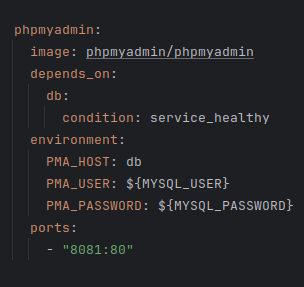
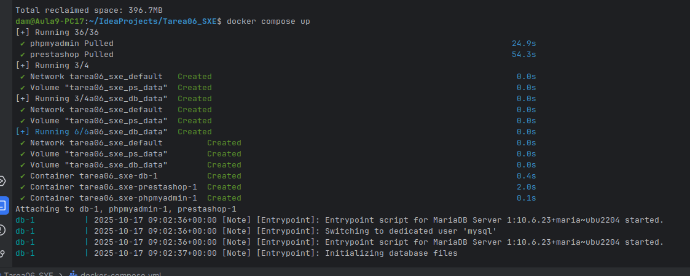
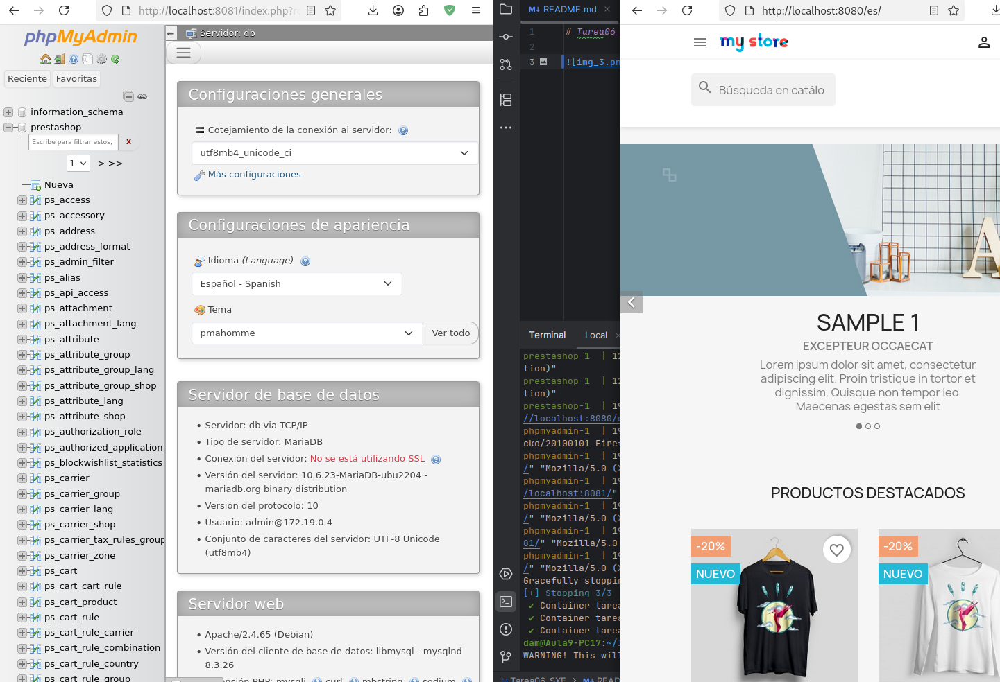

# Tarea06_SXE - Docker + PrestaShop + MariaDB + phpMyAdmin

Este proyecto utiliza Docker Compose para levantar un entorno completo con una base de datos MariaDB, PrestaShop como CMS de e-commerce, y phpMyAdmin como gestor visual de la base de datos.

## 🧱 Estructura del proyecto

El `docker-compose.yml` define tres servicios principales:

---

### 🔹 1. Base de datos (MariaDB)


- Se utiliza la imagen `mariadb:10.6`, preferida frente a MySQL por compatibilidad con PrestaShop y ciertos sistemas operativos.
- Las variables de entorno como `MYSQL_ROOT_PASSWORD`, `MYSQL_DATABASE`, `MYSQL_USER`, y `MYSQL_PASSWORD` están definidas en un archivo `.env`.
- Se monta un volumen para persistir los datos: `db_data:/var/lib/mysql`.
- El `healthcheck` se encarga de comprobar que la base de datos esté activa y lista antes de iniciar otros servicios.

---

### 🔹 2. PrestaShop


- Imagen utilizada: `prestashop/prestashop:8.1`.
- Usa `depends_on` con condición de salud (`condition: service_healthy`) para esperar a que la base de datos esté lista.
- Variables de entorno:
    - `DB_SERVER`, `DB_NAME`, `DB_USER`, `DB_PASSWD`: conexión a la base de datos.
    - `PS_INSTALL_AUTO`: instala PrestaShop automáticamente.
    - `PS_DOMAIN`, `PS_LANGUAGE`, `PS_COUNTRY`, `ADMIN_MAIL`, `ADMIN_PASSWD`: configuración inicial.
- Expone el puerto `8080` para acceder desde el navegador: [http://localhost:8080](http://localhost:8080).
- Usa el volumen `ps_data` para guardar datos persistentes de PrestaShop.

---

### 🔹 3. phpMyAdmin



- Imagen utilizada: `phpmyadmin/phpmyadmin`.
- También espera a que el servicio `db` esté saludable.
- Variables de entorno necesarias para conectarse al contenedor de MariaDB.
- Expone el puerto `8081` para acceso web: [http://localhost:8081](http://localhost:8081).

---

## Comandos

Para ejecutar el entorno, utiliza el siguiente comando:

```bash
docker compose up
```

Si algo falla, puedes detener la ejecución con `Ctrl+C`. Luego, para limpiar completamente el entorno (incluyendo los volúmenes), ejecuta:

```bash
docker compose down -v
docker volume prune -a
```

### Posibles errores

1. **La base de datos no pasa el *healthcheck***  
   Esto suele indicar un problema en la configuración del servicio `db` (por ejemplo, variables de entorno incorrectas o conflictos en los volúmenes). Revisa tu archivo `docker-compose.yml` y el archivo `.env`.

2. **Los datos aparecen vacíos o la instalación no se completa**  
   Es muy probable que Docker Compose no esté cargando tu archivo `.env`. Por defecto, **solo se carga automáticamente un archivo llamado exactamente `.env`** (sin prefijo ni sufijo adicional).  
   Si tu archivo se llama, por ejemplo, `config.env` o `mi_entorno.env`, **no se leerá automáticamente**, aunque termine en `.env`.

   En ese caso, puedes:
    - Renombrar tu archivo a `.env`, **o**
    - Especificar explícitamente el archivo al ejecutar:

      ```bash
      docker compose --env-file nombre.env up -d
      ```



Por último, una vez que los contenedores estén en ejecución, puedes acceder a las dos aplicaciones desde tu navegador:

- PrestaShop: [http://localhost:8080](http://localhost:8080)
- phpMyAdmin: [http://localhost:8081](http://localhost:8081)

Es importante verificar que ambas páginas se carguen correctamente **antes de modificar el código**. A veces, los mensajes en la terminal pueden ser confusos y hacer parecer que el sistema no funciona, cuando en realidad sí lo hace.


```