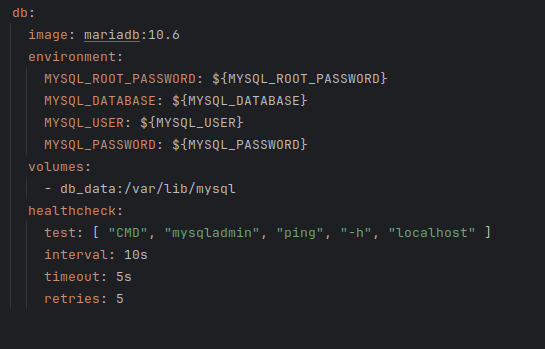
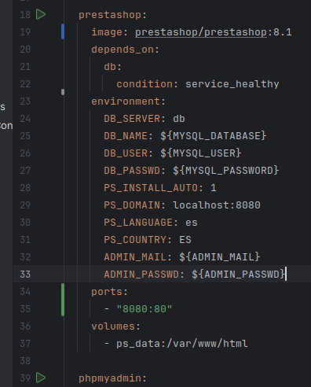

# Tarea06_SXE

## Codigo

Este programa esta dividido en 3 partes, el bd, prestashop y phpmyadmin:

- bd

con la imagen se especifica cual quieres utilizar, puedes utilizar mySQL, pero por algunos errores que pueden ocurrir con la compatibilidad de algunos sistemas operativos, es mas recomendable utilizar mariadb.

en enviroment especificas los datos, yo la mayoría de datos los tengo en un archivo .env, que funciona escribiendo las variables en el archivo y luego llamandolas ${nombre_de_variable}.

El healthcheck sirve para que nos sirve para garantizar que el db esté listo para que se ejecuten los demás servicios

- prestashop

depends_on sirve para que el servicio espere a otro, asi nos aseguramos que se ejecute despues. En este caso prestashop está esperando a que se verifique que db sea saludable.

en el enviroment se vuelve a poner los datos necesarios, esta vez hay bastantes ya que estamos programando que se nos instale automaticamente mediante install auto y despues recoge datos como el lenguaje.

el puerto sirve para despues poder acceder desde el navegador desde http://localhost:8080/

- phpmyadmin

Funciona igual que el prestashop

## Comandos

Para ejecutarlo se utiliza docker compose up, si te falla puedes salir con ctrl+c, luego escribes docker compose down -v y a posterior docker volume prune -a para poder borrar los volúmenes. Errores que puedan suceder son que la bd no sea healthy y que los datos aparezcan vacios. Para el primer error lo mas posible es que este mal programado el codigo. Para el segundo seguramente no te detecta el archivo .env porque lo llamaste de otra forma, aunque el archivo termine en .env, este no se leera automaticamente si no es de la otra forma, puedes cambiar el nombre o en vez de eso ejecutar el programa con el siguiente comando  docker compose --env-file nombre.env up -d.
 

Por ultimo, puedes acceder a las 2 webs mediante el navegador con los puertos escritos, en mi caso 8080 y 8081. Es importante asegurarse de que esto funciona antes de cambiar nada en el código, ya que a veces lo que aparece en la terminal puede ser algo confuso y parezca que no funciona cuando si que lo hace.

